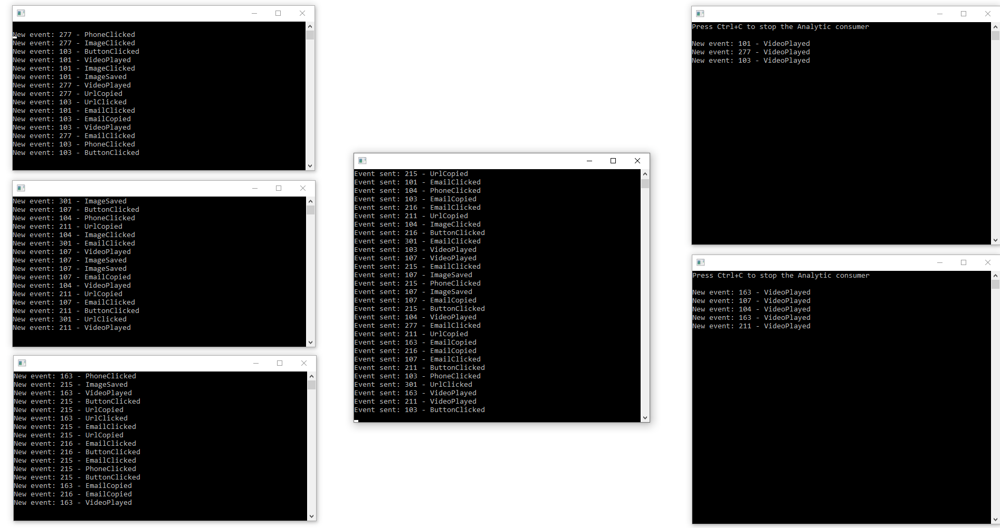

# KafkaJourney

This is an implementation of **pub-sub** pattern using **Kafka**.  
The application simulates user journey on a web page, producing such events as button clicks, url clicks, video plays etc.

### Main Tools and Technologies
- Kafka
- MSSQL

### Required Infrastructure

- [.NET 7.0 SDK](https://dotnet.microsoft.com/download/dotnet/7.0)
- [Docker](https://docs.docker.com/get-docker)
- [MSSQL](https://www.microsoft.com/en-us/sql-server/sql-server-downloads)

To start the infrastructure via Docker type the following command at the solution directory:

```
docker compose up -d
```

## About

This project consists of a producer and two consumer apps which utilize Kafka for event streaming.  
JourneyConsumer collects all events in that order they were produced, whereas AnalyticConsumer is only interested in 'VideoPlayed' events and stores the total number of them for each user.  

These two consumers represent two **consumer groups** - Journey and Analytic.  
Within each group we can spin up **as many instances of the consumer as number of partitions are available in the topic**. If to specify more consumers than available number of partitions, extra consumers will be idle.  
The main rule of thumb is **number of partitions >= number of consumers**.  

Depending on the key value of a  message, each event will be distributed to the dedicated partitions. **Events with the same key always go to the same partition**.

**Messages are unique within the consumer group**, but duplicated among all topic's consumer groups.  
To test this behavior, run three instances of the JourneyConsumer, two instances of the AnalyticConsumer and one Producer instance. Each message emitted by Producer will be delivered to one of the consumers in each consumer group (you may see that on the screenshot).

Both of the consumers follow the **'at-least-once delivery'** processing. It is achived by setting the `EnableAutoOffsetStore` to `false` in appsettings.json file and manually commiting the offset after successful event processing - `consumer.StoreOffset(result);`


## Usage:

These applications don't untilize the Host service, therefore IDesignTimeDbContextFactory is used to apply the migrations. 
1. Apply the migrations from JourneyConsumer and AnalyticConsumer apps. The command for applying from CLI:
    ```bash
    dotnet ef database update -- 'your_connnection_string'
    ```
2. Start Docker and run `docket-compose.yml`.
3. Start MSSQL Server (or if it's added in your docket-compose - skip this step)
4. Create a new topic in Kafka. To do this either navigate to `http://localhost:9021` (Confluent Contorl Center Portal) or create it via Kafka CLI tool in Docker. While creating the topic, note, that the **topic name must match the corresponding constant from KafkaShared/Constants file**.
5. Set the desired number of partitions (in our example it is 3). Note, **number of partitions >= number of consumers in a consumer group**.
6. Start several instances of JourneyConsumer and AnalyticConsumer apps. 
7. Start the Producer.

After producer is started, it automatically produces a random events each second which then are delivered to consumers by Kafka.

