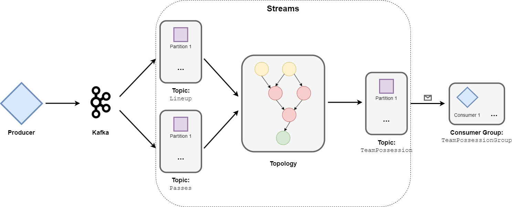
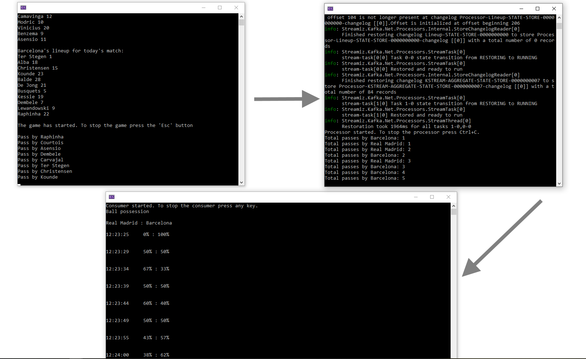

# KafkaStreams

This is an implementation of **Kafka Streams**.  
The application simulates football match statistic capturing. It captures starting lineups of each team, passes made by players and eventually uses both streams to enrich, transform and produce the final data - total ball possession for each team.

### Main Tools and Technologies
- Kafka
- Streamiz.Kafka.Net
- KafkaFlow

### Required Infrastructure

- [.NET 7.0 SDK](https://dotnet.microsoft.com/download/dotnet/7.0)
- [Docker](https://docs.docker.com/get-docker)

To start the infrastructure via Docker type the following command at the solution directory:

```
docker compose up -d
```

## About

This project consists of a producer, processor and consumer apps.  
**Producer** generates new events with the specified time interval.  
**Processor** listens for the incoming events in a real time, enriches, transforms and downstreams modified message to the ouput topic.  
**Conumer** reacts to the messages that were downstreamed into the output topic. Consumer keeps track of current state of the statistics and displays it in a specified format.  

### General flow:

1. Producer sends starting lineups of both teams into the **Lineup** topic;
2. After lineups revealed, producer sends events which represents passes in football. One event = one pass. Pass is made by one player among all others. The player is picked up randomly each time. These events go to the **Passes** topic;
3. Proccessor listens to messages in **Lineup** topic. It stores them into a **KTable** - state store, which **only stores the latest event**;
4. Proccessor listens to messages in **Passes** topic. It collects them into a **KStream** - handles the stream of records, **tracks each record sequentially**;
5. Processor joins messages from the Lineup topic with the messages from the Passes topic by a player id, thus enriching the original data and outputting new objects;
6. Processor groups enriched messages by team id, thus calculating total passes made by each team at the specific moment;
7. Processor downstreams transformed data to the **TeamPossession** topic;
8. Consumer listens to **TeamPossession** topic, updates its state depending on message values from the topic and displays statistic in percents on the console.



## Usage:

1. Start Docker and run `docket-compose.yml`;
2. It is recommended to create topics manually - via portal (`http://localhost:9021`) or Kafka CLI (**topic name must match the corresponding constant from KafkaShared/Constants file**). However there's the setting that tells apps to create topics if those not found. In case when relying on apps - they sould be started in following order: consumer, producer, processor. You may also consider to change Topic config according to your needs;
3. Start all of the three apps.

